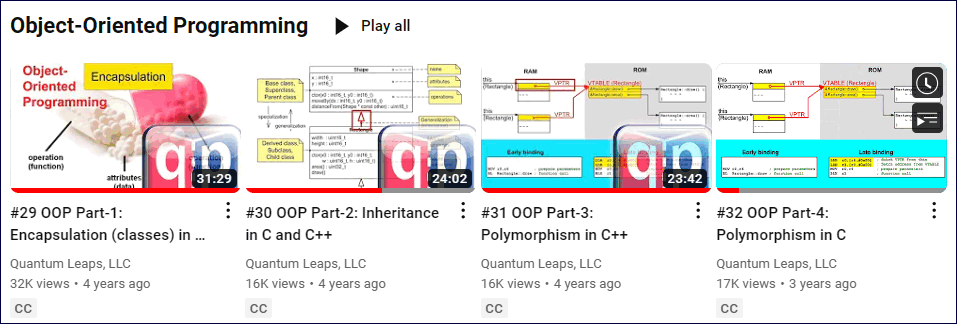
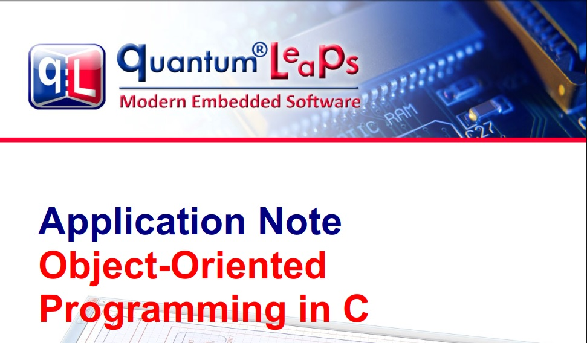

## Brought to you by:
[](https://www.state-machine.com)

---------------------------------------------------------------------
[](https://github.com/QuantumLeaps/OOP-in-C/releases/latest)
[](https://github.com/QuantumLeaps/OOP-in-C/blob/master/LICENSE)

# Object-Oriented Programming in C
This repository provides the code accompanying the article (as well as videos):
["Object-Oriented Programming in C"](https://www.state-machine.com/oop).
The code can be compiled and executed on any desktop
computer (running Windows, Linux, or macOS), although it is also suitable for real-time embedded applications.

# Videos
The concepts of OOP in C have been explained in a <a href="https://www.youtube.com/playlist?list=PLPW8O6W-1chzoLFm2eLy11AoGiYbApjc4" target="_blank" title="Object-Oriented Programming in C Playlist">series of videos</a>:

<p align="center">
<a href="https://www.youtube.com/playlist?list=PLPW8O6W-1chzoLFm2eLy11AoGiYbApjc4" target="_blank" title="Object-Oriented Programming in C Playlist">

</a><br>
<em>Object-Oriented Programming in C Playlist</em>
</p>

- [OOP part-1 "Encapsulation"](https://youtu.be/dSLodtKuung)
- [OOP part-2 "Inheritance"](https://youtu.be/oS3a7wn9P_s)
- [OOP part-3 "Poylmorphism in C++"](https://youtu.be/xHMje9fL1Bk)
- [OOP part-4 "Polymorphism in C"](https://youtu.be/2v_qM5SJDlY)


# Quick Example

Here is a class `Shape` in portable ISO-compliant C (e.g., for displaying shapes on a LCD):

```
// file shape.h

// Shape's attributes...
typedef struct {
    int16_t x; // x-coordinate of Shape's position
    int16_t y; // y-coordinate of Shape's position
} Shape;

// Shape's operations (Shape's interface)...
void Shape_ctor(Shape * const me, int16_t x, int16_t y);
void Shape_moveBy(Shape * const me, int16_t dx, int16_t dy);
int16_t Shape_getX(Shape const * const me);
int16_t Shape_getY(Shape const * const me);
```

And here are some examples of using the `Shape` class:

``` 
#include "shape.h"  // Shape class interface
#include <stdio.h>  // for printf()
. . .

Shape s1; // instances of Shape (object)
Shape s2; // another instance of Shape (object)

Shape_ctor(&s1, 0, 1);
Shape_ctor(&s2, -1, 2);

printf("Shape s1(x=%d,y=%d)\n", Shape_getX(&s1), Shape_getY(&s1));
printf("Shape s2(x=%d,y=%d)\n", Shape_getX(&s2), Shape_getY(&s2));

Shape_moveBy(&s1, 2, -4);
Shape_moveBy(&s2, 1, -2);

printf("Shape s1(x=%d,y=%d)\n", Shape_getX(&s1), Shape_getY(&s1));
printf("Shape s2(x=%d,y=%d)\n", Shape_getX(&s2), Shape_getY(&s2));
```

# Code Organization

```
OOP-in-C/
+---doc/
¦       AN_OOP_in_C.pdf
¦
+---encapsulation/
¦       main.c
¦       make.bat
¦       shape.c
¦       shape.h
¦
+---inheritance/
¦       main.c
¦       make.bat
¦       rect.c
¦       rect.h
¦       shape.c
¦       shape.h
¦
+---polymorphism/
        circle.c
        circle.h
        main.c
        make.bat
        rect.c
        rect.h
        shape.c
        shape.h
```

# Building and Running the Code
Each of the sub-directories contains `make.bat` (for Windows) that
allows you to build and run the provided examples. (On Linux/macOS
you can execute the commands from `make.bat` directly from the tarminal).

For example:

```
C:\GitHub\OOP-in-C>cd encapsulation
C:\GitHub\OOP-in-C\encapsulation>make

gcc shape.c main.c -o oop_in_c
oop_in_c

Shape s1(x=0,y=1)
Shape s2(x=-1,y=2)
Shape s1(x=2,y=-3)
Shape s2(x=0,y=0)
```

# The PDF Version
The PDF version of the
["Object-Oriented Programming" article](doc/AN_OOP_in_C.pdf)
is provided in the directory `doc`

<p align="center">
<a href="doc/AN_OOP_in_C.pdf" target="_blank" title="App Note: OOP in C">

</a><br>
<em>Application Note: OOP in C [PDF]</em>
</p>

# Licensing
The OOP-in-C source code and examples are released under the terms of the
permissive [MIT open source license](LICENSE). Please note that the
attribution clause in the MIT license requires you to preserve the
original copyright notice in all changes and derivate works.


# How to Help this Project?
If you like this project, please give it a star (in the upper-right corner of your browser window):

<p align="center">

</p>

# Contact Information
- [state-machine.com](https://www.state-machine.com)
- [state-machine.com/oop](https://www.state-machine.com/oop)
