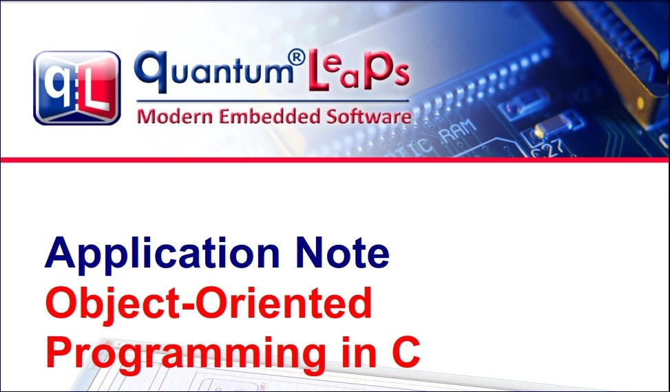

## Brought to you by:
[](https://www.state-machine.com)

---------------------------------------------------------------------
[](https://www.state-machine.com/oop)

# The Accompanying Code
This repository provides the code accompanying the article:
["Object-Oriented Programming"](https://www.state-machine.com/oop).
The code can be compiled and executed on any desktop
computer (running Windows, Linux, or macOS).

Here is the code structure:

```
OOP-in-C
+---doc
¦       AN_OOP_in_C.pdf
¦
+---encapsulation
¦       main.c
¦       make.bat
¦       oop_in_c.exe
¦       shape.c
¦       shape.h
¦
+---inheritance
¦       main.c
¦       make.bat
¦       oop_in_c.exe
¦       rect.c
¦       rect.h
¦       shape.c
¦       shape.h
¦
+---polymorphism
        circle.c
        circle.h
        main.c
        make.bat
        oop_in_c.exe
        rect.c
        rect.h
        shape.c
        shape.h
```

# Building and Running the Code
Each of the sub-directories contains `make.bat` (for Windows) that
allows you to build and run the provided examples. (On Linux/macOS
you can execute the commands from `make.bat` directly from the tarminal).

For example:

```
C:\GitHub\OOP-in-C>cd encapsulation
C:\GitHub\OOP-in-C\encapsulation>make

gcc shape.c main.c -o oop_in_c.exe
oop_in_c.exe

Shape s1(x=0,y=1)
Shape s2(x=-1,y=2)
Shape s1(x=2,y=-3)
Shape s2(x=0,y=0)
```

# Videos
The concepts of OOP in C have been explained in a series of videos:

- [OOP part-1 "Encapsulation"](https://youtu.be/dSLodtKuung)
- [OOP part-2 "Inheritance"](https://youtu.be/oS3a7wn9P_s)
- [OOP part-3 "Poylmorphism in C++"](https://youtu.be/xHMje9fL1Bk)
- [OOP part-4 "Polymorphism in C"](https://youtu.be/2v_qM5SJDlY)


# The PDF Version
The PDF version of the 
["Object-Oriented Programming" article](https://www.state-machine.com/oop)
is provided in the directory `doc`

[](doc/AN_OOP_in_C.pdf)


# Contact Information
- [state-machine.com](https://www.state-machine.com)
- [state-machine.com](https://www.state-machine.com/oop)
